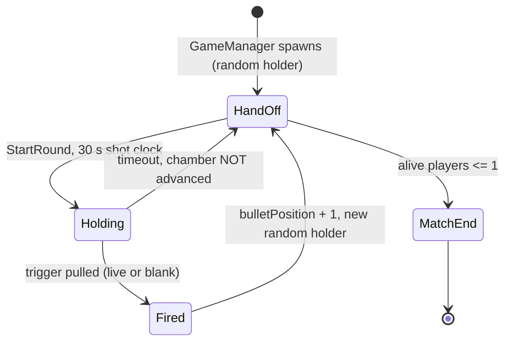
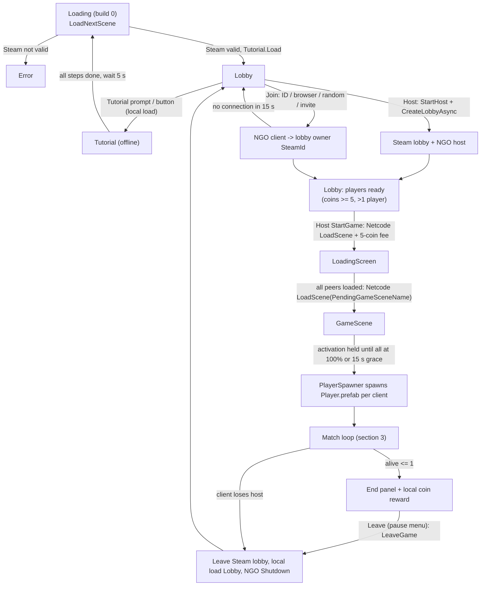

# DuckRoulette - Game Design Document (As Implemented)

| Field | Value |
|---|---|
| Document version | 1.0 |
| Code snapshot | commit `7422ea5` (branch `main`) |
| Engine | Unity 6000.5.4f1, URP |
| Status | Living document |

## Changelog

| Version | Date | Change |
|---|---|---|
| 1.0 | 2026-09-15 | First as-implemented snapshot, taken from code, prefabs and scenes at `7422ea5`. |

## How to read this document

- **Implemented** content in sections 1-10 describes what the code does today. Every rule has a citation of the form `File.cs:line`.
- Paths are relative to `Assets/Scripts/` unless a longer path is given. Line numbers refer to commit `7422ea5` and will drift as the code changes.
- **Open questions / Proposed** items are marked explicitly. Section 11 collects them. No tuning value in this document has been playtested: treat every number as `[PLACEHOLDER]` until it has been.
- Where the code's intent can't be confirmed from source alone, the text says "appears" or "not found at HEAD".

---

## 1. Overview, pitch, pillars

### 1.1 Pitch (Implemented)

DuckRoulette is a first-person online party game for 2-6 Steam friends. Players roam a shared map while one hidden player holds a six-chamber revolver:

- The holder draws the gun, reloads, cocks it and pulls the trigger at whoever they are aiming at.
- A blank clicks and passes the gun on. The live chamber fires a real bullet that eliminates whoever it hits.
- Everyone else fills the time with slapping, teaming up, hiding, chatting over proximity voice, playing blackjack, and doing small tasks that decide who is allowed to hold the gun next.
- The last player alive wins coins, which persist on Steam Cloud and pay the lobby's entry fee.

### 1.2 Design pillars (inferred from implementation)

These pillars are reconstructed from code comments and mechanics. They are not an authored vision statement.

1. **Hidden threat.** Nobody is told who holds the gun. The turn label is deliberately never shown (`ShotClockUI.cs:34-38`). Hand-off feedback plays only for the new holder (`GameManager.cs:589-612`). The gun starts holstered at every hand-off (`GameManager.cs:183-186`).
2. **Luck with agency.** The chamber decides *whether* the gun fires (`Shooting.cs:299`); the holder decides *where* it is aimed (`Shooting.cs:332,434`). The shooter can never hit themselves (`DeathTrigger.cs:153`).
3. **Physical social chaos.** Slaps stack into ragdoll knockouts, teammates dap each other, voice fades with distance and walls, and a boombox can be carried and thrown.
4. **Stay busy or lose the gun.** The next holder is drawn from players who finished all of their tasks (`GameManager.cs:944-969`).
5. **Short Steam sessions.** Lobbies hold 2-6 players (`MaxPlayers.cs:19-25`), the host is the server, and invites, friends and cloud saves all go through Steam.

### 1.3 Scope snapshot

| Area | State at `7422ea5` |
|---|---|
| Maps | One networked map, `GameScene` (build index 2) |
| Modes | Free-for-all last-player-standing; optional 2-player team-ups |
| Offline | Scripted tutorial (`Tutorial.unity`) |
| Progression | Coins only; cosmetics are free to equip |

---

## 2. Target platform and technology (Implemented)

| Item | Detail | Source |
|---|---|---|
| Platform | PC (Windows standalone) via Steam, keyboard/mouse and gamepad. No other platform code was found. | `PauseMenu.cs:70-73`, `InputSys/Inputs.inputactions` |
| Engine | Unity 6000.5.4f1, Universal Render Pipeline | `ProjectSettings/ProjectVersion.txt` |
| Netcode | Netcode for GameObjects 2.13, host-client model; the Steam lobby owner is host | `Lobby/GameNetworkManager.cs:176-206` |
| Transport | Facepunch transport; clients connect to the host's SteamId | `GameNetworkManager.cs:297` |
| Steam features | Lobbies (public / friends / private), invites and join requests, rich presence, friends list, Remote Storage (coins, cosmetics, tutorial flag), voice capture and codec | `GameNetworkManager.cs:44-50,142-156,469-481`; `SaveSystem.cs`; `Cosmetics.cs:13`; `Tutorial/TutorialData.cs:13`; `Player/VoiceChat.cs` |
| Not used | Unity Relay, Authentication, Cloud Save, Vivox | CLAUDE.md |
| Other packages in use | Input System (rebindable), Cinemachine 3, Animation Rigging, TextMeshPro | `using` directives |
| Player count | 2-6 (max-members input is clamped) | `MaxPlayers.cs:19-25` |

---

## 3. Core loop (Implemented)

### 3.1 Loop summary

| Layer | Content |
|---|---|
| Moment-to-moment (0-30 s) | Move, slap, hide, team up, talk. If you hold the gun: draw, reload, cock, aim, fire. |
| Round (at most 30 s per holder) | One holder, one trigger pull or a timeout, then a hand-off to another alive player |
| Match | Rounds repeat until 1 or fewer players are alive; stats and coins are shown |
| Long-term | Coins persist on Steam Cloud and pay the 5-coin entry fee; cosmetics persist |

### 3.2 Match start

- `PlayerSpawner` (host only) spawns one `Player.prefab` per client that finished loading `GameScene` (`PlayerSpawner.cs:58-72`).
- `GameManager` sits on a child GameObject of `Player.prefab` named `GameManger`. The first instance wins and later copies destroy themselves (`GameManager.cs:42-52`).
- On spawn, the server does the following:
  - Marks every connected client alive and sets the alive count (`GameManager.cs:91-102`).
  - Resets `Death.isDead` to `false` (`GameManager.cs:111-119`).
  - Picks a random first holder and starts the first round (`GameManager.cs:121-126`).
- `_coinsToWin = ConnectedClientsIds.Count * 5` is fixed at this moment (`GameManager.cs:129`).
- Late connections are added as alive (`GameManager.cs:68-81`).

### 3.3 Turn and round state machine

**Hand-off.** `CheckPlayerGunScript` (`GameManager.cs:190-205`) runs every time the gun changes hands:

1. `RoundManager.StartRound()` resets the clock to `roundDuration` = **30 s** (`RoundManager.cs:6,73-90`; serialized as 30 in `GameScene.unity`).
2. `canShoot = true` (`GameManager.cs:197`).
3. A coroutine starts that waits **5 s** (`GameManager.cs:204`) and then:
   - rolls rain (section 4.8);
   - re-broadcasts the holster RPC (`GameManager.cs:213-216`);
   - deals fresh tasks to every alive player (`GameManager.cs:218`, section 4.5).

The 5 s wait runs *inside* the 30 s shot clock; it does not delay it.

**Holster at hand-off.** Every hand-off disables `Shooting` on every client, unless that client is mid Trigger or Reload animation (`GameManager.cs:167-188`). The holder has to draw the gun with Change Weapon. `HideGun` only allows the draw while `playerWithGun == me && canShoot`, and forces the gun away as soon as the turn ends (`Player/HideGun.cs:27-47`).

**Holder selection.** `GetRandomClientId(excluded)` works like this (`GameManager.cs:936-988`):

1. It builds a pool of alive players other than the excluded one who have **no outstanding tasks**. Having no tasks assigned also counts (`TaskManager.cs:341-352`).
2. If that pool is empty, it falls back to all alive players except the excluded one.
3. If that is also empty, it uses all connected players except the excluded one.
4. It picks uniformly at random from the result.

The excluded player is the shooter after a shot, or the timed-out holder after a timeout.

**Timeout.** The server decrements `_remainingTime` (`RoundManager.cs:53-72`). At 0 it ends the round and calls `GameManager.PassGunOnTimeout`, which picks a new holder (excluding the current one) **without advancing the chamber** and without anyone shooting (`GameManager.cs:151-164`, `RoundManager.cs:103-114`).

**One pull per holding.** Once a pull has executed, the client blocks any further pull until the component is re-enabled for a new holding (`Shooting.cs:286-305`).

### 3.4 Gun operation (holder)

| Step | Input | Preconditions | Effect | Source |
|---|---|---|---|---|
| Draw / holster | Change Weapon | It is your turn and `canShoot` | Toggles `Shooting` on or off. Slap is disabled while the gun is out. | `HideGun.cs:44-47`, `Shooting.cs:628-631` |
| Reload | Reload | `!isReloaded && canShoot` | Server rolls `randomBulletPosition = Random.Range(0,6)` and sets `isReloaded = true` | `Shooting.cs:196-224`, `GameManager.cs:222-226` |
| Cock (Trigger) | Trigger | `isReloaded`, not mid-Reload, not already cocked | `isTriggered = true` | `Shooting.cs:234-248` |
| Fire | Shoot, or a *new* Trigger press on a later frame | Cocked, not mid-Trigger animation | Pull resolves (section 3.5); `hasShot = true` goes to the server through an owner-gated RPC | `Shooting.cs:259-279,358,455-477` |

Once cocked, the "Triggering" state clears when the Shooting animation ends, or after a 3 s safety cutoff (`Shooting.cs:400-423`).

### 3.5 Chamber rules and math

- `bulletPosition` is a **match-global** chamber index. It starts at 0 and advances by `(bulletPosition + 1) % 6` on **every** pull, live or blank (`GameManager.cs:147`). It does not advance on a timeout (`GameManager.cs:151-164`).
- `randomBulletPosition` is the live chamber, re-rolled uniformly in [0, 5] on each reload (`GameManager.cs:224`).
- A pull is **live** when `bulletPosition == randomBulletPosition` (`Shooting.cs:299`).
- `isReloaded` only returns to `false` after a live shot (`Shooting.cs:428`). After a blank the gun stays loaded, and the next holder **cannot** reload (`Shooting.cs:198`).

**Resulting odds.** After a reload, the live round sits a uniform 1-6 pulls ahead, and nobody can re-roll until it fires. Across consecutive holders, the chance that each successive pull is live is:

| Pull after reload | 1 | 2 | 3 | 4 | 5 | 6 |
|---|---|---|---|---|---|---|
| P(live, given all earlier pulls were blanks) | 1/6 | 1/5 | 1/4 | 1/3 | 1/2 | 1 |

Each pull has an unconditional 1/6 chance of being the live one. So the danger escalates across the lobby as blanks accumulate, and the holder only fully controls re-rolling when they are the first to pick up an unloaded gun.

### 3.6 Live shot, hit and elimination

| Rule | Value | Source |
|---|---|---|
| Bullet spawn | Server instantiates it and gives the shooter ownership; direction = `targetAim - spawnPoint` | `Shooting.cs:425-439` |
| Bullet speed | 15 units/s, no gravity, continuous collision | `BulletBehaivor.cs:9,19-23,42` |
| Bullet lifetime | Server despawns it after 5 s | `BulletBehaivor.cs:29-32` |
| Hitboxes | 13 `DeathTrigger` colliders per player, de-duplicated per client | `Player/Death.cs:8-15,38-47` |
| Valid hit | bullet owner != victim AND victim not dead AND not a teammate | `DeathTrigger.cs:152-153` |
| Detector | *Any* peer whose physics sees the hit reports it; only the shooter's client despawns the bullet and credits the kill | `DeathTrigger.cs:81-113` |
| Death | Server checks `isDead`, marks the player inactive, sets `isDead = true`, ragdolls them on all peers, plays death VFX/SFX | `GameManager.cs:231-325` |
| Kill credit | `UpdateKillsServerRpc(shooterId, 1)`; any amount other than 1 is rejected | `GameManager.cs:674-690` |
| Hidden victims | A bullet hitting an occupied hiding spot kills the hider (same teammate and self checks) | `HidingSpot.cs:348-390` |
| Miss | Nobody dies; the gun has already been passed | `GameManager.cs:136-149` |

**Spectate.** The victim sees a death banner naming the killer and the camera shakes (`DeathTrigger.cs:120-132`). After **5 s** the camera cuts to the killer's spectate camera at priority 20 (`DeathTrigger.cs:131-161`). SpectateNext cycles through alive players; the view auto-retargets every 0.5 s if the watched player dies (`DeathTrigger.cs:171-216`).

### 3.7 Disconnects

On the server, a disconnect does the following (`GameManager.cs:550-587`):

- marks the player inactive;
- if they held the gun, reassigns it and starts a new round, unless 1 or fewer players remain (`GameManager.cs:1019-1030`);
- clears their pending team-up requests and breaks their team, notifying the survivor.

On a client, losing the host triggers `Disconnected()` and a local load of `Lobby` (`GameNetworkManager.cs:404-423`).

### 3.8 Win condition and match end

| Rule | Value | Source |
|---|---|---|
| End trigger | Alive count <= 1 after any `MarkPlayerInactive` (death or disconnect) | `GameManager.cs:1032-1035` |
| Winner | First alive entry in `_playerStates`; `ulong.MaxValue` if nobody is alive | `GameManager.cs:1040-1051` |
| Stats sync delay | 0.5 s after `UpdateStatsClientRpc` | `GameManager.cs:392-406` |
| Coin reward (every player) | `kills * 2 + 1` | `GameManager.cs:454` |
| Winner bonus | `+ _coinsToWin` = players connected at match start x 5 | `GameManager.cs:129,455-458` |
| Reward application | Each client adds its **own** computed reward to its local `Coin` | `GameManager.cs:463-506` |
| End panel columns | Name (winner in yellow), kills, coins, time survived, accuracy = kills / live shots, luck = blanks / (live + blanks) | `GameManager.cs:439-494` |

After the end panel, input is disabled and the pause menu can no longer be opened (`PauseMenu.cs:78-95`).

---

## 4. Secondary mechanics (Implemented)

### 4.1 Movement

| Parameter | Value | Source |
|---|---|---|
| Walk speed | 3 (prefab); code default 2 | `Player.prefab`, `Movement.cs:19` |
| Sprint | x2, only while moving forward and not crouched; hold or toggle (setting) | `Movement.cs:493-516` |
| Jump height / gravity | 1.5 / -9.81 | `Player.prefab`, `Movement.cs:25,31,572` |
| Coyote time | 0.2 s | `Movement.cs:27,543` |
| FOV | Walk = setting (60-110, default 60); run 70 | `Movement.cs:112-113`, `GameplaySettings.cs:34-36` |
| Pitch clamp | -85 to 75 degrees | `Movement.cs:441` |
| Ice (tag `Ice`) | Velocity lerps toward input x 1.2 | `Movement.cs:457-468,528-533` |
| Slide ("toboggan") | Jumping on ice starts a slide: horizontal speed x 2.5 (or forward x 3.5 from standstill), capsule height 0.5, decay rate 1.5, plus a 0.6 s lockout once momentum is gone | `Movement.cs:98-107,684-748` |
| Gun on ice | A player with the gun drawn cannot jump on ice, so cannot slide | `Movement.cs:544-547` |

### 4.2 Ground parry (movement tech)

This is a landing trick, not a defense against slaps.

| Parameter | Value | Source |
|---|---|---|
| Window | Jump pressed within 0.15 s before touchdown | `Movement.cs:36,561` |
| Cooldown | 1.5 s; one attempt per airtime | `Movement.cs:45,555-564` |
| Effect | Jump height x 1.25, horizontal velocity x 1.3; starts a slide on ice; "+PARRY" HUD; networked VFX | `Movement.cs:38-40,598-621` |
| Speed boost | Declared x 1.25 for 2 s and read at `Movement.cs:526`, but no assignment to `parrySpeedBoostEndTime` was found, so it appears inert | `Movement.cs:42-43,56,526` |

### 4.3 Slap, stun, knockout

- **Input and gating.** Slap only works while the gun is holstered (`Shooting.cs:628-631`). Cooldown is 1.5 s on the prefab (code default 1 s; `Slap.cs:27,53-66`).
- **Hit test.** An overlap sphere of radius 0.82 on the `otherPlayers` layer; only the first valid target is slapped (`Slap.cs:80-102`).
- **Stun threshold.** The *attacker's* client keeps a per-target counter. The limit is `Random.Range(3,10)`, i.e. 3-9 slaps, re-rolled after each stun (`Slap.cs:104-131,180-190`). The counter and limit reset 60 s after the last slap that did not stun (`Slap.cs:128-129,172-177`).
- **Stun.** `GameManager.StunPlayerServerRpc` rolls **3-6 s** once and broadcasts it, so every peer ragdolls for the same time (`GameManager.cs:332-365`).
  - Overhead dizzy stars show for wake time + 2 s (`Ragdoll.cs:144-150`).
  - The victim's own screen daze lingers 2-3 s after standing (`Ragdoll.cs:41-42,165-168`).
- **Recovery.** Movement, TeamUp and Slap come back; **Shooting stays off**, so a knocked-down holder must re-draw (`Ragdoll.cs:318-335`).
- **Feedback.** The attacker gets a camera shake. The victim gets a camera shake, a red screen flash and a direction arrow (`Slap.cs:83-86,270-290`; `Player/SlapFeedback.cs`; `SlapDirectionHUD.cs`). Slap SFX/VFX are broadcast at the impact point (`Slap.cs:138-169,198-245`).
- **Rocks.** Falling weather rocks stun any `Hittable` object they hit (`Rocks.cs:16-23`).

### 4.4 Team-up and dap

| Rule | Value | Source |
|---|---|---|
| Range | Sphere radius 2.5 (prefab; code default 2); prompt "Team Up" | `Player.prefab`, `TeamUp.cs:13,134-152` |
| Request | Press Interact near a player; 5 s cooldown; only if not teamed and no pending incoming request | `TeamUp.cs:17-18,158-162` |
| Server bookkeeping | Pending request stored as responder -> requester; target notified "Press E to accept" | `GameManager.cs:694-723`, `TeamUp.cs:191-203` |
| Accept | Target presses Interact while still in range; the request is dropped locally if they leave range | `TeamUp.cs:163-176,184-187` |
| Validation | Server accepts only a response matching a real pending request | `GameManager.cs:732-736` |
| Dap | `perfectDap = Random.Range(0,2)` (50%) selects the "perfect" sound; VFX/SFX at the dap point; cosmetic only | `TeamUp.cs:168`, `GameManager.cs:745-746`, `TeamUp.cs:216-227` |
| Visual | Both players get the server-written outline colour (default green) | `GameManager.cs:750-758`, `TeamUp.cs:32` |
| Benefit | Immune to the teammate's bullet, including in hiding spots | `DeathTrigger.cs:152`, `HidingSpot.cs:367-373` |
| End | EndTeamUp input; both outlines return to black | `TeamUp.cs:111-127`, `GameManager.cs:789-807` |
| Team size | Pairs only; a player who is already teamed ignores new requests | `TeamUp.cs:193-196`, `GameManager.cs:716-719` |

The win condition ignores teams: the last *individual* alive wins (`GameManager.cs:1032`).

### 4.5 Tasks

- **Authoring.** A task is a `Challenge` ScriptableObject with name, description, interaction verb, icon, difficulty and type (`Challenge.cs`). It enters rotation only while a live objective registers it (`TaskManager.cs:62-92`). Objectives are `TaskObjective`, `BumBox.musicTask` or `CardDeck.blackjackTask`.
- **Dealing.**
  - At each hand-off + 5 s, the server clears all tasks and deals up to `tasksPerRound` = **3** distinct tasks to every alive player, the holder included (`TaskManager.cs:147-231`; `Player.prefab`).
  - `ThreePlus` tasks are skipped while fewer than 3 players are alive (`TaskManager.cs:213-217`).
- **Completion.**
  - Solo objectives send a sender-validated RPC; a client can only complete its own open task (`TaskManager.cs:259-277`).
  - Group completion (blackjack) is resolved on the server (`TaskManager.cs:283-303`).
  - Only the completing player hears or sees the feedback (`TaskManager.cs:305-336`).
- **Consequence.** A player with any open task is skipped for the gun whenever someone eligible exists (section 3.3).

**Task pool in `GameScene` at HEAD** (resolved from asset GUIDs):

| Task asset | Type | Objective present in GameScene? | Completion |
|---|---|---|---|
| Campfire | Useless | Yes (`TaskObjective` on the Campfire prefab) | Interact "Light" (`Tasks/TaskObjective.cs:115-130`) |
| Boombox | Useless | Yes (`Bumbox.prefab` `musicTask`) | Press ChangeMusic on the box (`BumBox.cs:70-86`) |
| BlackJack | ThreePlus | Yes (`BlackjackTable.prefab`) | Finish a blackjack round with 3 or more seated (`CardDeck.cs:682-695`) |
| MailBox | Useless | **No objective found**, never dealt | - |
| Team Up | Useful | **No objective found**, never dealt | - |

With 3 registered tasks and `tasksPerRound = 3`, every alive player is currently dealt the same full set: all three with 3 or more alive, or Campfire and Boombox with fewer. The `difficulty` field is not read by `TaskManager`.

### 4.6 Hiding spots

| Rule | Value | Source |
|---|---|---|
| Instances in GameScene | 1 x `HidingLog`, 1 x `Pipe` | `GameScene.unity` prefab instances |
| Enter | Interact prompt "Hide", raycast range 5; not allowed with the gun drawn; one occupant at a time | `HidingSpot.cs:39,51-56`, `Interact.cs:10,147-150` |
| Validation | Server requires `clientId == sender` | `HidingSpot.cs:65-81,108-122` |
| While hidden (all peers) | Model, name tag and gun hidden; CharacterController disabled; a decoy model shown | `HidingSpot.cs:83-106,168-192` |
| While hidden (owner) | Spot camera at priority 20; look clamped to yaw +/-60 and pitch +/-40; Movement, TeamUp, Shooting and Slap disabled | `HidingSpot.cs:29-32,220-265,304-315` |
| Duration | Auto-exit after `hideDuration` = **10 s** (all prefabs) | `HidingSpot.cs:35,392-402` |
| Exit | Interact again, the timeout, or being shot; the player is restored to where they entered | `HidingSpot.cs:267-297` |
| Danger | A bullet hitting the spot kills the occupant | `HidingSpot.cs:348-390` |

### 4.7 Boombox

| Rule | Value | Source |
|---|---|---|
| Pick up | Interact "Pick Up"; not with the gun drawn; the server moves the box to the hold point every frame | `BumBox.cs:9,125-136`, `Interact.cs:171-197,301-307` |
| Drop / throw | Interact again; physics re-enabled and a forward impulse of 5 | `BumBox.cs:138-149,197-215` |
| Mute | Mute input while aiming at or holding the box; toggles pause for everyone | `BumBox.cs:151-154,217-237` |
| Change track | ChangeMusic input; the server advances `trackIndex` (wraps); late joiners get the current track | `BumBox.cs:28,51-61,70-123` |
| Task | Changing the track completes the Boombox task if it is open | `BumBox.cs:79-85` |

### 4.8 Weather and rocks

- **Rain roll.** Once per match, at each hand-off + 5 s: `chance% = 1.0155 ^ Time.timeSinceLevelLoad` (`GameManager.cs:877-890`).
  - About 2.5% at 60 s, 6.3% at 120 s, 15.9% at 180 s, 40% at 240 s.
  - Guaranteed from about 299 s.
- **Effect.** Raises the static `OnWeatherChange` event. `WeatherHandler` then spawns 10-19 rocks per second for 20 s inside a box (`WeatherHandler.cs:8,36-47,66-87`). Rocks despawn after 10 s or on impact and stun `Hittable` targets (`Rocks.cs:7-23`).
- **Status.** `WheaterHandler.prefab` is referenced only by `TestingEnviroment.unity`. **In GameScene nothing listens to the event, so weather has no gameplay effect.**

### 4.9 Blackjack table

- **Seating.** Interact "Play Blackjack" (`BlackjackTable.cs:17,71-84`). Seats are the table's `Hand...` children and the first free chair is used (`CardDeck.cs:137-176`). A full table replies "The table is full!".
- **Deck.**
  - Card values 1-10, with no aces or face cards (`CardDeck.cs:10-13`).
  - 4 copies of each card asset (`CardDeck.cs:496`).
  - Draws are made from the remaining stock (`CardDeck.cs:471-482`).
- **Flow.** Everything is server-authoritative (`CardDeck.cs:7-13`).
  1. On sitting, the player is dealt one card (`CardDeck.cs:160`).
  2. On your turn, Draw takes exactly one card and passes the turn (`CardDeck.cs:313-383`). Done stands (`CardDeck.cs:564-576`).
  3. A hand over 21 busts and is out for the round (`CardDeck.cs:363-371`).
  4. Exactly 21 is an instant win that ends the round (`CardDeck.cs:373-376,614-623`).
  5. When everyone is done, the highest hand of 21 or under wins; ties share the win (`CardDeck.cs:626-678`).
- **Reward.** The win counter `playerInGameList` is incremented. No coin or UI reward was found. A finished round with 3 or more seated completes the BlackJack task for all of them (`CardDeck.cs:682-695`; `taskMinimumPlayers = 3` on the prefab).
- **Leave.** LeaveBlackjack input or Interact again. A disconnect frees the seat (`BlackJack/BlackJack.cs:54-57`, `BlackjackTable.cs:61-69`, `CardDeck.cs:219-277`).

### 4.10 Proximity voice chat

| Rule | Value | Source |
|---|---|---|
| Activation | Push-to-talk on the Talk input (prefab: `pushToTalk = 1`; toggle and open-mic flags exist, both 0) | `VoiceChat.cs:24,83-91`, `Player.prefab` |
| Transport | Owner reads compressed Steam voice; server relays it to **all** other clients | `VoiceChat.cs:93-124` |
| Falloff | Listener side: volume = `1 - d/25` within 25 m, 0 beyond | `VoiceChatRaycast.cs:9,55-58,83-86` |
| Occlusion | If any of three rays (head / chest / feet) hits a wall: volume x 0.5 plus a low-pass filter | `VoiceChatRaycast.cs:60-81` |
| Speaking indicator | Replicated `isTalking` shows the mic icon and a "spit" effect | `VoiceChat.cs:39,54-58` |

Dead players are not separated into their own voice channel; no such code was found.

### 4.11 Lobby social features

- **Chat.** Keeps the last 20 messages; server messages are red and whispers purple (`LobbyManager.cs:30,209-269`). Commands: `/msg <name> <text>`, `/r <text>`, and `/kick <name>` (host only) (`LobbyManager.cs:94-181`).
- **Kick.** Validated on the server (sender must be the server), then the target is disconnected (`NetworkTransmission.cs:100-126`).
- **Player cards.** Clicking a card opens kick (host, not self), message and more (`PlayerInfo.cs:25-46`).
- **Steam.** Invites and join requests, a friends list grouped into in-game / online / offline (`GameNetworkManager.cs:80-96`, `Lobby/SteamFriendManager.cs:70-95`), and rich presence "In-Lobby" / "In-Game #Map1" (`GameNetworkManager.cs:469-481`).

---

## 5. Economy (Implemented)

### 5.1 Currency and persistence

| Item | Rule | Source |
|---|---|---|
| Currency | `Coin.amount` (int). The singleton lives in the `Loading` scene and persists across scenes. | `Coin.cs:4-7,39-50` |
| Starting balance | 100 when Steam is valid and no save exists | `Coin.cs:27-31` |
| Save | JSON `{coinAmount}` to Steam Remote Storage file `Coin.Value`; written on quit, focus loss and pause | `SaveSystem.cs:7-34`, `Coin.cs:57-76` |
| Load | On `Coin.Start` | `Coin.cs:52-55` |

### 5.2 Sources and sinks

| Flow | Amount | When | Source |
|---|---|---|---|
| Source: participation | +1 | Every match end, every player | `GameManager.cs:454` |
| Source: kills | +2 per kill | Match end | `GameManager.cs:454` |
| Source: win | + 5 x players at match start | Match end, winner only | `GameManager.cs:129,455-458` |
| Sink: entry fee | -5 | Host presses Start; applied on **every** client | `GameNetworkManager.cs:497`, `NetworkTransmission.cs:206-216` |
| Gate: ready | Ready requires `amount >= 5` and more than one player card | `LobbyManager.cs:413-416` |
| Gate: start | Host's Start and Map buttons appear only when every card is ready and has enough coins | `LobbyManager.cs:418-450` |
| Cosmetics | Free: no price or unlock check | `Cosmetics.cs:20-91` |
| Blackjack | No stakes and no payout | `CardDeck.cs:614-678` |

### 5.3 Per-match outcomes (derived)

| Case | Formula | Net after fee |
|---|---|---|
| Loser, 0 kills | 1 - 5 | -4 |
| Loser, 1 kill | 3 - 5 | -2 |
| Loser, 2 kills | 5 - 5 | 0 (break-even) |
| Winner, 2-player lobby, 1 kill | 3 + 10 - 5 | +8 |
| Winner, 4-player lobby, 0 kills | 1 + 20 - 5 | +16 |
| Winner, 6-player lobby, 5 kills | 11 + 30 - 5 | +36 |

**Lobby-wide money supply.** With N players and K total shooting kills (at most N-1), each match mints `N + 2K + 5N` and destroys `5N`. The net is `N + 2K`, which is `3N - 2` when every elimination is a kill: +4 per match for 2 players up to +16 for 6. The economy inflates with no further sink.

### 5.4 Cosmetics persistence

- **Lobby avatar.** Hat, accessory and shirt indices cycle through 0..Count, where 0 means none (`Cosmetics.cs:20-91`).
- **Save.** Each change saves `"hat,acc,shirt"` to Steam Cloud file `cosmeticData.txt` (`Cosmetics.cs:13,93-107`).
- **In match.** `NetworkCosmetics` on `Player.prefab` / `Character.prefab` reads the file on the owner and sends the indices through `ChangeNetVarsServerRpc`. The server stores them in three `NetworkVariable<int>`s, and every peer instantiates the items (`NetworkCosmetics.cs:11,17-31,92-133`).
- **Validation.** The server does not range-check the indices.

---

## 6. Scene and session flow (Implemented)

### 6.1 Build scenes

| Build index* | Scene | Role |
|---|---|---|
| 0 | Loading | Boot: Steam check, loads the tutorial flag, hosts the `Coin` and `PlayerSpawner` singletons (`LoadNextScene.cs:10-26`) |
| 1 | Lobby | Menus, Steam lobby, chat, ready, cosmetics, map choice, tutorial prompt |
| 2 | GameScene | The match (holds `RoundManager` and `StatTracker`) |
| 3 | Error | Shown when Steam is not running |
| 4 | Tutorial | Offline tutorial |
| 5 | LoadingScreen | Networked loading screen between Lobby and the map |

\* `TestingEnviroment` is disabled in Build Settings. Assuming Unity's usual behaviour of excluding disabled scenes from runtime build indices, the indices above apply.

### 6.2 Flow diagram

### 6.3 Step details

1. **Boot.** If `SteamClient.IsValid`, the game loads the tutorial flag, waits for `NetworkManager`, then loads `Lobby`; otherwise it loads `Error` (`LoadNextScene.cs:10-26`).
2. **Tutorial prompt.** If the tutorial has not been completed, the prompt offers it; Dismiss marks it completed (`TutorialPromptDialog.cs:12-25`).
3. **Hosting.** The host picks max members (2-6) and a visibility toggle (public / friends / private). The lobby is named `<SteamName><random suffix>` from `Resources/RandomLobbyNames` (`GameNetworkManager.cs:134-174`).
4. **Joining.** Players join by ID, from the lobby browser (distance filter "close", up to 20 results, entries without a name are hidden), by random join, or through a Steam invite (`GameNetworkManager.cs:208-271,513-602`). `OnLobbyEntered` starts the NGO client aimed at the owner's SteamId, with a 15 s timeout (`GameNetworkManager.cs:121-132,273-332`).
5. **Lobby presence.** On connect, the server spawns a `Character.prefab` player object for the lobby grid and registers the player card (`NetworkTransmission.cs:66-98`). The client then reports ready = false plus its coin check (`GameNetworkManager.cs:439-443`).
6. **Map choice.** The default is build index 2, GameScene (`GameNetworkManager.cs:23`). `ChooseMap(index)` or `ChooseRandomMap()` can change it; the random pick is `Random.Range(2, sceneCount)` (`GameNetworkManager.cs:501-510`).
7. **Start.**
   - The host calls `StartGame()`, which stores `PendingGameSceneName`, loads `LoadingScreen` **through Netcode**, and charges the fee (`GameNetworkManager.cs:484-498`).
   - On the server, `LoadingScreenController` waits for the LoadingScreen load event to complete, then Netcode-loads the pending scene (`LoadingScreenController.cs:259-265`).
   - Each peer holds its scene activation (`LoadingScreenController.cs:268-282`). Activation is released when every connected peer reports 100%, or 15 s after the first peer is ready (`LoadingScreenController.cs:102,453-510`).
   - Each peer's progress bar ramps to 50% over 2.5 s, then tracks the real load (`LoadingScreenController.cs:80-108`).
8. **Spawn.** On the GameScene load event, the host spawns `Player.prefab` for every completed client. `isStarted` is reset whenever `Lobby` loads (`PlayerSpawner.cs:46-73`).
9. **Exit.**
   - `PauseMenu.Leave` calls `GameManager.LeaveGame`. That leaves the Steam lobby, hides prompts, loads `Lobby` locally and calls `NetworkManager.Shutdown()` (`PauseMenu.cs:45-51`, `GameManager.cs:635-672`).
   - `GameManager.OnDisable` on the singleton also calls `LeaveGame` (`GameManager.cs:614-626`).
   - `PlayerSpawner.GoBackToLobby` handles a *Netcode* load of `Lobby` (`PlayerSpawner.cs:75-108`), but no code at HEAD issues that load, so every exit ends the session.

---

## 7. Controls and input (Implemented)

Source: `Assets/Scripts/InputSys/Inputs.inputactions`. All actions can be rebound (`RebindSaveLoad.cs`).

| Action | Keyboard / Mouse | Gamepad | Used by |
|---|---|---|---|
| Move | WASD | Left stick | `Movement` |
| Look | Mouse delta | Right stick | `Movement`, `HidingSpot` |
| Run | Left Shift | Left trigger | `Movement` (hold or toggle) |
| Crouch | Left Ctrl | Left shoulder | `Movement` (hold or toggle) |
| Jump / Ground parry | Space | South | `Movement` |
| Change Weapon | Scroll up | Right shoulder | `HideGun` |
| Reload | R | East | `Shooting` |
| Trigger (cock) | Right mouse | Right trigger | `Shooting` |
| Shoot | Left mouse | Right trigger | `Shooting` |
| Slap | Left mouse | Right trigger | `Slap` (only when holstered) |
| Interact (pick up, hide, team up / accept, blackjack, tasks) | E | South | `Interact`, `TeamUp` (UI map) |
| Mute boombox | F | North | `Interact` |
| Change music | N | D-pad up | `Interact` |
| End team-up | X | West | `TeamUp` |
| Talk | V | D-pad down | `VoiceChat` |
| Spectate next | Space | South | `DeathTrigger` |
| Blackjack: Draw / Done / Leave | Z / G / Enter | South / East / West | `BlackJack` |
| Blackjack (action "Blackjack") | C | North | No script reference found |
| Pause | Esc | Start | `PauseMenu` |

**Shared bindings** (context-resolved or overlapping):

- LMB and RT carry Shoot, Slap and Trigger. They are split by whether `Shooting` is enabled, and by the "different frame than the cock press" guard (`Shooting.cs:259-273`).
- Gamepad South carries Jump, Interact, Draw and SpectateNext.
- Gamepad East carries Reload and Done; gamepad West carries EndTeamUp and LeaveBlackjack.

**Game settings:** FOV 60-110, invert Y, toggle crouch, toggle sprint, show task list, reduce motion, flashing effects, UI scale (`GameplaySettings.cs:34-46`), plus mouse and controller sensitivity for each axis (`SettingsManager.cs:26-29`).

---

## 8. UI and HUD inventory (Implemented)

| Element | Purpose | Source |
|---|---|---|
| Shot clock | Radial fill + seconds for the whole match. Amber for your own turn only; red, pulsing and urgent ticks at 5 s or less; per-second tick SFX; the holder is never named. | `ShotClockUI.cs:20-109` |
| Task list | The local player's tasks for the round, with animated rows; hidden by the `ShowTaskList` setting | `TaskListHUD.cs` |
| Interaction prompt | Verb + device-correct key or button icon ("Hide", "Pick Up", "Team Up", task verb) | `InteractionPromptHUD.cs` |
| Spectate HUD | Death banner with the killer's name; "Spectating X" plus a Next hint | `SpectateHUD.cs`, `DeathTrigger.cs:128,218-226` |
| Parry popup | "+PARRY" fade-in/out with a punch scale | `ParryFeedbackHUD.cs` |
| Slap direction | Compass arrow pointing at the attacker | `SlapDirectionHUD.cs` |
| Screen effects | Red hit flash (slap), dizziness (knockout), death vignette (desaturate, dim) | `Player/HitFlash.cs`, `Player/DizzinessEffect.cs`, `Player/DeathVignette.cs` |
| Message box | Toasts with priority and duration (team-up, tutorial, notices) | `MessageBox.cs` |
| Mic indicator | Icon and "spit" effect over players who are talking | `VoiceChat.cs:54-58` |
| Name tags | Steam name over remote players (hidden on the owner and while hiding) | `Username.cs`, `HidingSpot.cs:175-178` |
| Crosshair | Hidden while paused or at match end | `PauseMenu.cs:58,69,83` |
| Pause menu | Resume, Leave, settings | `PauseMenu.cs` |
| End-of-match panel | Per-player row: name, kills, coins, time, accuracy, luck | `GameManager.cs:429-525` |
| Blackjack table UI | Turn text, message feed | `CardDeck.cs:43-44,98-103` |
| Lobby | Player cards (avatar, name, ready colour), chat, lobby ID copy, visibility toggles, lobby browser rows (name, members/max), friends list, click menu (kick / message), ready / not ready / start / map buttons, coin display | `LobbyManager.cs`, `NetworkTransmission.cs:178-204`, `PlayerInfo.cs`, `UpdateCoinValueUI.cs` |
| Loading screen | One progress bar per player with Steam avatar and name | `LoadingScreenController.cs` |

---

## 9. Tutorial (Implemented)

**Mode.**

- `Tutorial.unity` runs with no listening `NetworkManager`, so `Shooting`, `Movement` and `Interact` run in local mode (`Shooting.cs:41`, `Interact.cs:26`).
- `TutorialManager` adds those shared components, injects rig wiring, and locks moving, jumping, crouching, interacting and shooting until the matching step unlocks them (`TutorialManager.cs:78-150`).
- Team-up (with TutoBot), slapping, footsteps and pause are offline-only reimplementations (`TutorialManager.Slap.cs`, `TutorialManager.TeamUp.cs`).

**Deterministic gun.**

- The live round is pinned to chamber 1 (`Tutorial.unity`), and every reload resets the cylinder to chamber 0. After reloading, the first pull is always a blank and the second always fires (`Shooting.cs:43-60,211-217,295,354`).
- Offline pulls are unlimited, but a reload is still required after each live shot (`Shooting.cs:321-328`).

**Step order.**

- Prompt N is shown until step N's event fires. The next prompt appears after the listed delay (`TutorialStepController.cs:45-63,101-212`).
- Steps may complete out of order; the chain never regresses (`TutorialStepController.cs:85-97`).

| # | Prompt (abridged) | Completes when | Unlocks / world event | Delay |
|---|---|---|---|---|
| 0 | Move mouse to look | Look input > 0.1 | Movement; door 0 | 1 s |
| 1 | WASD to move | Move input > 0.1 | - | 2 s |
| 2 | Hold SHIFT to sprint | Run held, moving forward, not crouched | Jump; door 1 | 2 s |
| 3 | Follow the sound, SPACE to jump | Jump pressed | Interact | 3 s |
| 4 | E to pick up Boombox | Object picked up | - | 1 s |
| 5 | E again to throw | Object dropped | - | 1 s |
| 6 | F to shut it down | Boombox mute toggled | Crouch; door 2 | 4 s |
| 7 | CONTROL to crouch | Crouch pressed | - | 4 s |
| 8 | Jump on ice to slide | Slide starts | Weapon switch; door 3; target doll active | 3 s |
| 9 | Scroll up for gun | Gun drawn | - | 1 s |
| 10 | R to reload | Reload | - | 7 s |
| 11 | RIGHT MOUSE to trigger | Cocked | - | 2 s |
| 12 | LEFT MOUSE to shoot the doll | Live shot fired | Doors 4 and 5; TutoBot activates; gun auto-holstered 2 s later and switching locked | 10 s |
| 13 | E near TutoBot to dap | Team-up with TutoBot | TutoBot starts moving | 3 s |
| 14 | V to talk | Talk pressed while teamed | - | 5 s |
| 15 | X to end team-up | Team-up ended | - | 1 s |
| 16 | LEFT MOUSE to slap TutoBot | 3 slaps (fixed limit) ragdoll the bot; slap unlocks only after holster + team-up end | - | 2 s |
| end | "Tutorial complete! enjoy." | - | Saves `hasCompletedTutorial` to Steam Cloud `TutorialData.json`; loads `Loading` after 5 s | - |

Sources for the unlocks: `TutorialManager.cs:223-414`, `TutorialManager.Slap.cs:15-66`, `TutorialData.cs:13-40`, `TutorialStepController.cs:67-77,214-219`. Tutorial rig values: slap cooldown 1.5, slap radius 0.82, team-up radius 1.5 (`Tutorial.unity`).

---

## 10. Networking authority model (Implemented)

### 10.1 Topology

- The Steam lobby owner runs the NGO host (server + local client). Clients connect over Facepunch P2P (`GameNetworkManager.cs:176-206,273-310`).
- `GameManager` and `TaskManager` live on child GameObjects of `Player.prefab`, with first-instance-wins guards (`GameManager.cs:42-52`, `TaskManager.cs:94-104`). Their client-callable RPCs therefore use `RequireOwnership = false` (`GameManager.cs:327-331`, `TaskManager.cs:255-258`).
- `RoundManager` is an in-scene object in `GameScene`.

### 10.2 Server-authoritative state

| State | Mechanism | Source |
|---|---|---|
| Gun holder, chamber index, live chamber, reloaded flag, `canShoot` | Server-write `NetworkVariable` | `GameManager.cs:13-18` |
| Alive count, alive map, kill counts, teams, pending team-ups | `NetworkVariable` / server-only dictionaries | `GameManager.cs:20-30` |
| Shot clock time and round-active flag | Server-write `NetworkVariable`; ticks only on the server | `RoundManager.cs:7-10,53-72` |
| Holder selection, hand-off, timeout, match end, winner | Server logic | `GameManager.cs:136-164,367-406,936-1051` |
| `Death.isDead` | Server-write `NetworkVariable` set in the death broadcast | `Death.cs:6`, `GameManager.cs:273-278` |
| Stun duration | Rolled once on the server | `GameManager.cs:339` |
| Team outline colour | Server-write `NetworkVariable` | `TeamUp.cs:32`, `GameManager.cs:765-774` |
| Task assignments and completion | Server `NetworkList`; completion keyed to the RPC sender | `TaskManager.cs:53,259-303` |
| Blackjack shoe, hands, seats, turn | Server dictionaries + `playerTurn` `NetworkVariable`; RPCs keyed to the sender | `CardDeck.cs:22-33,114-161,313-384` |
| Boombox track | Server-write `NetworkVariable` | `BumBox.cs:28,90-99` |
| Bullet spawn and despawn timer | Server instantiates (shooter owns it) | `Shooting.cs:430-432`, `BulletBehaivor.cs:29-32` |
| Player name, cosmetic indices | Server-write `NetworkVariable`s filled from owner RPCs | `Username.cs`, `NetworkCosmetics.cs:11,127-133` |
| Loading progress and activation latch | Server `NetworkList` / `NetworkVariable` | `LoadingScreenController.cs:111-118` |
| Lobby kick | Server checks the sender is the server | `NetworkTransmission.cs:103-104` |

### 10.3 Owner-authoritative state

| State | Mechanism | Source |
|---|---|---|
| Player transform and animation | `ClientNetworkTransform`, `OwnerNetworkAnimator` | `Network/ClientNetworkTransform.cs`, `Network/OwnerNetworkAnimator.cs` |
| `Shooting.hasShot`, `haveGun` | Owner-write `NetworkVariable`; the shot is reported through an owner-gated `ServerRpc` | `Shooting.cs:18,23,467-477` |
| `Stats` (time survived, shots, blanks) | Owner-write `NetworkVariable` | `Player/Stats.cs:6-8` |
| `VoiceChat.isTalking` and voice payload | Owner-write `NetworkVariable`; owner-gated relay RPC | `VoiceChat.cs:39,108-124` |
| Input components | `Movement`, `Shooting`, `Slap`, `TeamUp`, `Interact`, `PauseMenu`, `Stats`, `BlackJack` are disabled on non-owners | respective `OnNetworkSpawn` |
| Hiding camera and position restore | Owner client | `HidingSpot.cs:219-297` |

### 10.4 Client-decided or client-trusted inputs (current trust boundary)

| Input | What the server trusts | Source |
|---|---|---|
| Hit detection | Any peer's local trigger contact; any client may call `UpdatePlayerStateServerRpc(victim, killer)` | `DeathTrigger.cs:74-115`, `GameManager.cs:231-254` |
| Kill credit | Caller-supplied `shooterId` | `GameManager.cs:674-690` |
| Live / blank outcome, reload, fire | Client computes `isValidShot` from replicated variables; the server spawns the bullet from client positions without checking the sender is the holder or that the chamber is live | `Shooting.cs:299,425-453,479-486` |
| Stun | Client-side slap counter; `StunPlayerServerRpc(clientId)` has no checks | `Slap.cs:36-38,104-131`, `GameManager.cs:332-340` |
| Team-up request / end | No range check; `teamMateId` not validated on end | `GameManager.cs:694-708,789-807` |
| Friendly fire | `TeamUp.isTeamedUp` / `teamMateId` are local fields, set only on the two teammates' own components | `TeamUp.cs:10-11`, `GameManager.cs:776-787`, `DeathTrigger.cs:152` |
| Held object movement | `MoveObjectServerRpc` moves any spawned `NetworkObject` by id | `Interact.cs:301-307` |
| Coins, fee, ready-with-coins | Computed and applied locally; ready flags are client-reported | `GameManager.cs:454-506`, `NetworkTransmission.cs:172-216`, `LobbyManager.cs:415` |
| Lobby chat | `_fromWho` and `isServer` flag are caller-supplied | `NetworkTransmission.cs:54-58` |
| Lobby registration | Caller-supplied SteamId, name, clientId | `NetworkTransmission.cs:66-98` |
| Cosmetic indices | Unchecked ints | `NetworkCosmetics.cs:127-133` |

---

## 11. Known risks, balancing questions, proposals

Items are observations from code unless marked **[PROPOSED]**. Every numeric proposal is **[PLACEHOLDER]** until playtested.

### 11.1 Functional risks (likely bugs)

1. **Random map can load a non-map scene.** `ChooseRandomMap` uses `Random.Range(2, sceneCountInBuildSettings)`. With indices 2-5 that includes Error, Tutorial and LoadingScreen, a 3-in-4 chance of a wrong scene (`GameNetworkManager.cs:505-510`).
2. **The gun can go to a player who is about to die.** The new holder is picked the moment the shot resolves (`GameManager.cs:145`), before the bullet lands. A death does not reassign the gun (`GameManager.cs:252`), so it can sit with a dead player for up to 30 s until the timeout.
3. **Gun re-holstered 5 s into each turn.** The delayed `UpdatePlayerShootingScripts` (`GameManager.cs:213-216`) disables `Shooting` on the new holder unless they are mid-animation (`GameManager.cs:178-186`). A holder who draws immediately loses the gun at the 5 s mark.
4. **Friendly-fire immunity is not replicated.** Bystander peers see `isTeamedUp = false` on remote copies, so they may report a teammate kill to the server (`DeathTrigger.cs:152`, `TeamUp.cs:10-11`).
5. **The match may end for everyone if the "GameManager host" player leaves.** `GameManager` sits on a player prefab instance, and its `OnDisable` calls `LeaveGame` (`GameManager.cs:614-626`). This depends on despawn behaviour and needs verification with a remote client.
6. **Weather is inert in GameScene.** No `WeatherHandler` instance exists there (section 4.8).
7. **Parry speed boost never applies** (section 4.2).
8. **No group return to the lobby.** Every exit shuts NGO down and loads `Lobby` locally (`GameManager.cs:635-657`). Players must re-host and re-join each match, and `PlayerSpawner.GoBackToLobby` is unreachable at HEAD.
9. **Unreachable tasks.** MailBox and Team Up are authored but never dealt (section 4.5).
10. **Boombox mute state is a toggle broadcast.** It is not replicated state, so late joiners can desync (`BumBox.cs:217-237`).

### 11.2 Security and trust risks

11. Any client can kill any player, grant kill credit, stun anyone, or fire a live bullet out of turn (section 10.4).
12. Coins are client-computed and stored in a user-writable Steam Cloud file, so both the fee and the reward are honour-system (`GameManager.cs:454-506`, `SaveSystem.cs`).
13. `MoveObjectServerRpc` lets a client teleport any `NetworkObject` (`Interact.cs:301-307`).
14. Chat can spoof "Server" messages (`NetworkTransmission.cs:54-58`).
15. Out-of-range cosmetic indices throw on every peer (`NetworkCosmetics.cs:63,77`).

### 11.3 Balancing questions

| # | Question | Evidence | Define "broken" before testing |
|---|---|---|---|
| B1 | Is "shoot someone else" the intended fantasy? The holder is never at risk from their own chamber (`DeathTrigger.cs:153`). | Section 3.6 | Holders always aim at the nearest visible player; blanks carry no tension for the holder |
| B2 | Does the global chamber make late pulls too deadly? Pull 6 after a reload is certain death for whoever is aimed at, and nobody can re-roll. | Section 3.5 | More than 50% of kills happen on pulls 5-6 |
| B3 | Is 30 s too long or short, given a 5 s task deal inside it and a mandatory draw, reload and cock? | `RoundManager.cs:6` | More than 30% of turns time out, or median turn under 8 s |
| B4 | Do audible blanks, reloads and trigger clicks reveal the hidden holder? All are positional broadcasts. | `Shooting.cs:533-582` | Non-holders identify the holder within 10 s in more than 70% of turns |
| B5 | Do tasks differentiate players? Everyone is dealt the identical set (3 tasks, 3 objectives), and the holder also gets tasks. | Section 4.5 | Eligible pool equals all alive players in more than 80% of hand-offs |
| B6 | Is the stun threshold readable? 3-9 slaps, reset after 60 s, tracked per attacker so two attackers never share progress. | `Slap.cs:104-131` | Players cannot predict a knockout; stun-locking a holder until timeout is repeatable |
| B7 | Should teammates be able to be the final two? Last-individual-standing plus friendly-fire immunity forces a betrayal. | Sections 4.4, 3.8 | Final-two teammates stall for more than 60 s |
| B8 | Is the economy inflationary by design? Net +3N-2 coins per match with free cosmetics and no other sink. | Section 5.3 | Median balance grows past 500 after 10 matches with nothing to spend on |
| B9 | Should the winner bonus scale on players at start (includes leavers) or on eliminations? | `GameManager.cs:129` | Early leavers inflate the pot |
| B10 | Is hiding too safe or too dangerous at 10 s with one-shot vulnerability? | `HidingSpot.cs:35` | Hiding win-rate delta above +/-15% versus not hiding |
| B11 | Rain chance reaches 100% only near 300 s; average match length is unknown. | `GameManager.cs:881` | Weather never fires in more than 90% of matches (once re-enabled) |
| B12 | Blackjack offers no reward beyond a group task. | `CardDeck.cs:614-678` | Table usage under 10% of match time |

### 11.4 Proposals (not implemented)

- **[PROPOSED]** Server-side shot validation: sender is the holder, `isReloaded`, chamber comparison done on the server, and aim clamped to the holder's camera.
- **[PROPOSED]** Server-computed coin rewards and fee, and a validated ready flag.
- **[PROPOSED]** Replicate team membership (for example a `NetworkVariable<ulong>` teammate id) and check friendly fire on the server.
- **[PROPOSED]** Reassign the gun when the current holder dies, not only when they disconnect.
- **[PROPOSED]** Restrict random map choice to an explicit map list.
- **[PROPOSED]** Netcode-driven return to `Lobby` so a group can rematch.
- **[PROPOSED]** A coin sink, for example priced cosmetics or blackjack stakes. Price `[PLACEHOLDER]`.
- **[PROPOSED]** Tasks-per-round below the registered pool size so assignments differ between players. Value `[PLACEHOLDER]`.

### 11.5 Open questions for the team

- Is `powerGunIsActive` a planned mechanic? It is never set true at HEAD (`GameManager.cs:18,213`).
- Is the unused `Blackjack` input action (C / North) meant to open the table?
- Should dead players have a separate voice channel, or be muted to the living?
- Target match length and target kills per match? These are needed to tune B2, B3, B8 and B11.

---

## 12. Glossary

| Term | Meaning in this codebase |
|---|---|
| Holder | The client id in `GameManager.playerWithGun`; the only player who can draw the gun |
| Hand-off | The server picking a new holder after a pull, a timeout, or the holder disconnecting |
| Round / turn | One holder's window, at most 30 s (`RoundManager`) |
| Match | A full game in `GameScene` until 1 or fewer players are alive |
| Shot clock | The replicated `RoundManager` remaining time and its HUD |
| Chamber index | `bulletPosition`: global 0-5 cylinder position, +1 per pull |
| Live chamber | `randomBulletPosition`: rolled on reload |
| Reload | Rolls the live chamber; only possible when the gun is unloaded |
| Trigger / cock | The press that arms the gun before firing |
| Pull | Firing a cocked gun; resolves to live or blank |
| Blank / empty shot | A pull where the chamber index is not the live chamber |
| Live shot | A pull that spawns a networked bullet |
| Elimination | `Death.isDead = true` plus inactive in `_playerStates` |
| Spectate | A dead player's camera following an alive player |
| Slap | Close-range hit with no damage; builds toward a stun |
| Stun / knockout | 3-6 s ragdoll triggered by slaps or rocks |
| Ground parry | A jump timed within 0.15 s before landing |
| Slide / toboggan | Momentum slide started by jumping on `Ice` |
| Team-up | A two-player alliance with bullet immunity |
| Dap | The team-up acceptance handshake; "perfect dap" is a 50% sound variant |
| Hiding spot | An `IInteractable` that hides a player for up to 10 s |
| Task / Challenge | A per-round objective; finishing all of them makes you eligible for the gun |
| TaskObjective | The world component that completes a Challenge |
| ThreePlus | A task type dealt only while 3 or more players are alive |
| Entry fee | 5 coins deducted from each client when the host starts |
| Coins | Persistent currency in Steam Cloud `Coin.Value` |
| Cosmetics | Hat, accessory and shirt indices in Steam Cloud `cosmeticData.txt` |
| Host | The Steam lobby owner running the NGO server and a local client |
| Local mode | `Shooting` / `Movement` / `Interact` running without a listening `NetworkManager` (tutorial) |
